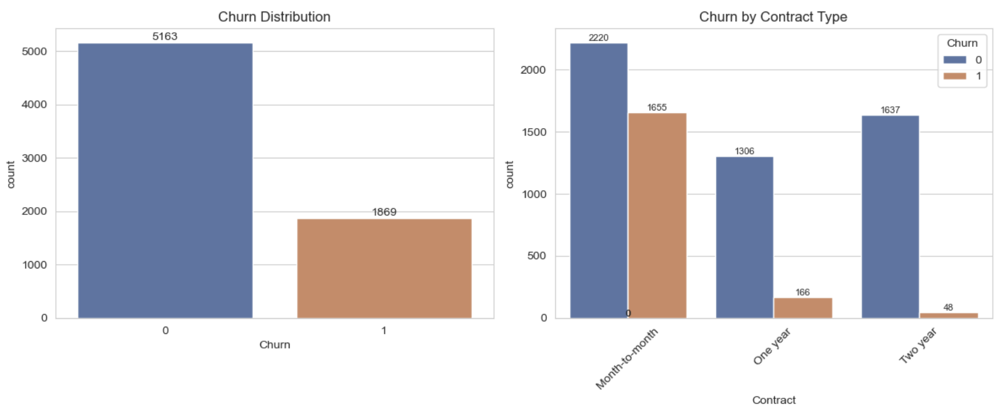
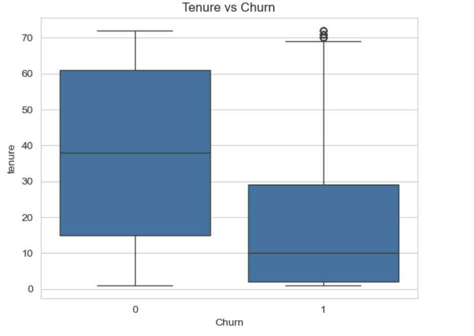
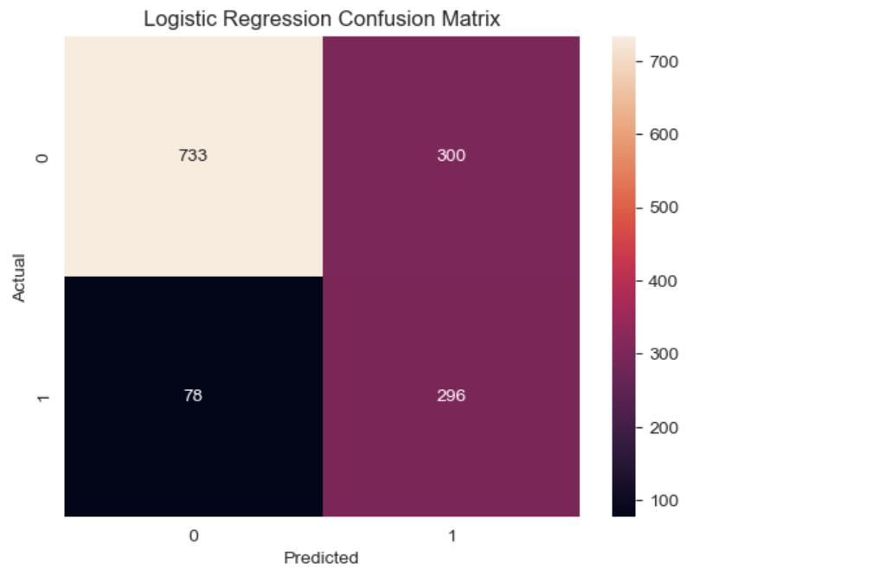
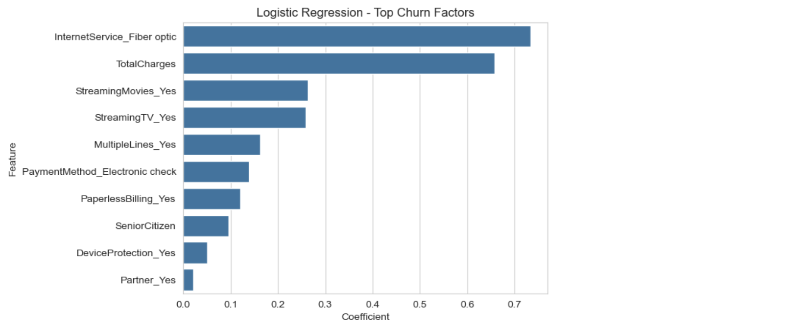

# Customer Churn & Retention Analysis

## Overview
This project analyses customer churn behaviour using Python and machine learning to identify key drivers of churn and support customer retention strategies.

## Tools Used
- Python
- Pandas
- NumPy
- Seaborn
- Matplotlib
- Scikit-learn

## Key Analysis
- Churn distribution analysis
- Contract type impact on churn
- Tenure and pricing behaviour analysis
- Machine learning model comparison

## Machine Learning Models
- Logistic Regression
- Random Forest

## Key Insights
- Around 26.6% of customers churned.
- Month-to-month contract customers showed the highest churn.
- Short-tenure customers were more likely to leave.
- Higher monthly charges were associated with churn.
- Logistic Regression performed better for identifying churn customers due to higher recall.

## Visualisations

